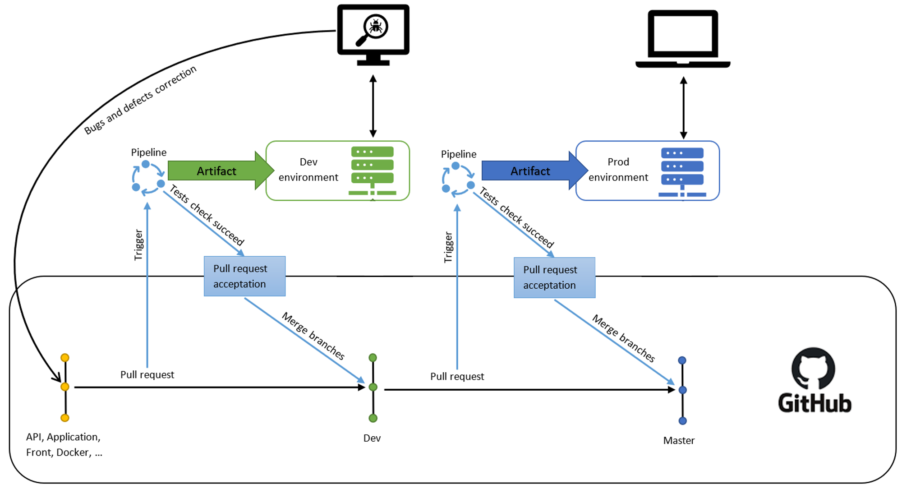

# Gearstock

Technical documentation

See User documentation: [USER.md](USER.md)

Document Version: 1.1 (05.02.2020 - MM/DD/YYYY)

Author: Valentin Lebon (valentin.lebon@epitech.eu)

## Table of Contents

- [Table of Contents](#Table-of-Contents)
- [Documentation](#Documentation)
  - [1. Dependences](#1-Dependences)
  - [2. Containerisation with Docker](#2-Containerisation-with-Docker)
  - [3. Build and launch Application](#3-Build-and-launch-Application)
  - [4. Update application](#4-Update-application)
    - [1. Changing docker-compose.yml or a Dockerfile file](#1-Changing-docker-composeyml-or-a-Dockerfile-file)
    - [2. Changing certbot's configuration](#2-Changing-certbots-configuration)
    - [3. Changing apache's configuration](#3-Changing-apaches-configuration)
    - [4. Updating website](#4-Updating-website)
    - [5. Updating API](#5-Updating-API)
    - [6. Changing MongoDB's admin's password](#6-Changing-MongoDBs-admins-password)
    - [7. Pipelines and pull requests](#7-Pipelines-and-pull-requests)

## Documentation

### 1. Dependences

You need Docker installed with docker-compose.

### 2. Containerisation with Docker

See [Docker official documentation](https://docs.docker.com/).

See [Docker Compose official documentation](https://docs.docker.com/compose/).

Services are describes in the docker-compose.yml file.

### 3. Build and launch Application

To build and launch the application, first check if the ```database/secrets.env``` file exist (see [6. Changing MongoDB's admin's password](#6-Changing-MongoDBs-admins-password)). Then, open a console/terminal and execute the following command in the root directory of this application.

```bash
docker-compose up --build -d
```

### 4. Update application

All commands in this part have to be executed in the root directory of this application.

#### 1. Changing docker-compose.yml or a Dockerfile file

When changing the docker configuration, you'll have to execute:

```bash
docker-compose up -d --build
```

#### 2. Changing certbot's configuration

To change cerbot (SSL) configuration, you'll have to change the Dockerfile in ```cerbot``` directory, then take a look at [Changing a Dockerfile file](#1-changing-docker-composeyml-or-a-dockerfile-file).

#### 3. Changing apache's configuration

When changing the apache configuration (under ```apache/conf``` directory), you'll have to exectute:

```bash
docker-compose stop apache && docker-compose up --build -d apache
```

#### 4. Updating website

If you want to update the website, you'll need to execute the command below, then wait for it to finish.

```bash
docker-compose up front
```

#### 5. Updating API

If you want to update the API, you'll need to execute this command:

```bash
docker-compose stop api && docker-compose run api_builder && docker-compose up -d api
```

#### 6. Changing MongoDB's admin's password

To change the admin's password of the MongoDB database, you'll have to change the ```MONGO_INITDB_ROOT_PASSWORD``` value in ```database/secrets.env```. If this file doesn't exit, create it.

To change the admin's username of the MongoDB database, you'll have to change the ```MONGO_INITDB_ROOT_USERNAME``` value in ```database/secrets.env```. If this file doesn't exit, create it.

//this part has to be updated to fit with mongo documentation !

Then you'll have to execute the following command:

```bash
docker-compose exec MongoDB /bin/bash
MongoDB -p
```

Then enter the old password and, replacing ```NEW_PASSWORD``` by the new password, execute:

```sql
ALTER USER 'root'@'localhost' IDENTIFIED BY 'NEW_PASSWORD'; ALTER USER 'root'@'172.19.%' IDENTIFIED BY 'NEW_PASSWORD';
```

Then, press ```Ctrl+C``` follow by ```Ctrl+D``` to quit, and execute:

```bash
docker-compose stop api && docker-compose up -d api
```

//The previous part has to be updated to fit with mongo documentation !

#### 7. Pipelines and pull requests

Gearstock's project's deployment's automatation is taking place in two environments: ```Dev``` and ```Prod```, each hosted on an Azure VM.

##### 1. The Dev environment

The ```Dev``` environment's behavior is to test together all the resources from the diferents branches to handle and correct (on those branches and NOT on dev branch) bugs and defects before uploading the resources to the ```Prod``` environment.

When a ```pull request``` is made to the ```dev branch```, a ```pipeline``` is triggered. This ```pipeline``` will run tests on a separated environment, where the acceptance of the ```pull request``` is simulated.

If all the tests succeed, the ```pull request``` is accepted and the resulted resources are updated to the ```dev branch``` and then to the ```Dev``` environment.

##### 2. The Prod environment

The ```Prod``` environment's behavior is to provide the Gearstock's project to the final users.

When a ```pull request``` is made from the ```dev branch``` to the ```master branch```, a ```pipeline``` is triggered. This ```pipeline``` will run tests on a separated environment, where the acceptance of the ```pull request``` is simulated.

If all the tests succeed, the ```pull request``` is accepted and the resulted resources are updated to the ```master branch``` and then to the ```Prod``` environment. The new version of the project is then available on Internet.

##### 3. The pipelines' schem


